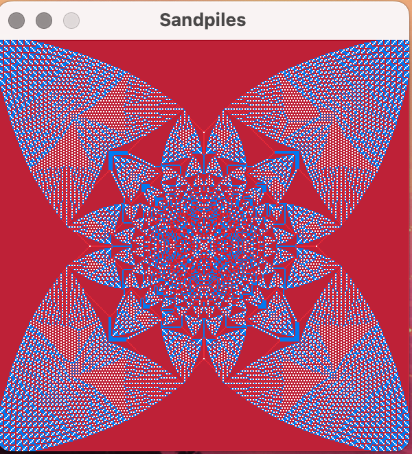

# Sandpile Cellular Automata

Sandpile Cellular Automata using the C programming language and the raylib library for visualization. The sandpile model is a type of cellular automaton that exhibits self-organized criticality, a property where a system naturally evolves into a critical state where a minor event can lead to significant consequences.



### Prerequisites

- **C Compiler**: Ensure you have a C compiler installed (e.g., GCC).
- **raylib**: Install the raylib library. You can download it from raylib's official website.

### Installation

1. **Clone the repository**:
    ```sh
    git clone https://github.com/FrexG/sandpile-automata.git
    cd sandpile-automata
    ```

2. **Build the project**:
    ```sh
    make
    ```

### Running the Application

To run the application, use the following command:
```sh
./sandpile
